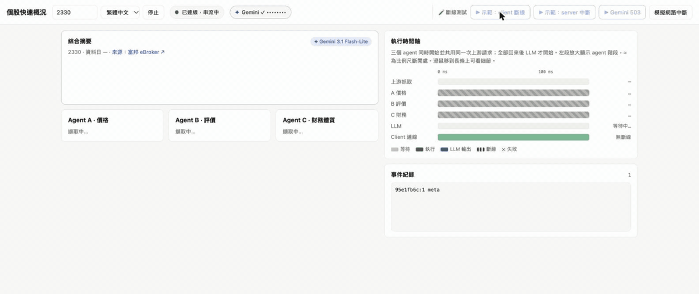

# Stock Overview Agents

Ask for a quick overview of a Taiwan stock (e.g. TSMC, 2330). Three retrieval agents pull price,
valuation and financial-health data **in parallel** from the
[Fubon eBroker page](https://fubon-ebrokerdj.fbs.com.tw/Z/ZC/ZCX/ZCX_2330.djhtm), and an LLM
synthesizes them into a short summary **streamed over SSE**. If the connection drops mid-stream, the
client shows it, reconnects with backoff, and **resumes from the last event it received** without
re-running the LLM.



*A real run with Gemini 3.1 Flash-Lite, using the **▶ Demo: client drop** button. The three agents
start together and share one upstream request. After Gemini's first tokens, the connection is cut at
the 3rd token, and the status reads "connection lost… reconnecting". The client resumes after
`Last-Event-ID …:8`, and the summary completes exactly once. On the timeline, ✕ marks the drop and
↻ #8 the resume. Playback is slowed at the drop so it's visible; the timings shown are real. The API
key is masked.*

Built with Next.js 15 (App Router) and TypeScript for both the API and the UI. **Google Gemini 3.1
Flash-Lite** (`gemini-3.1-flash-lite`) does the synthesis, using an API key the user enters in the page.

**Why Flash-Lite, pinned:**
- The job is light: three bullets from numbers we supply, with no reasoning or outside knowledge.
- A small model tends to give a faster first token, which the brief asks for.
- In practice it is less often hit by 503 "high demand" than the larger models.
- A pinned version (not a `-latest` alias) means behavior can't silently change.

**Measured** (two real runs, so a small sample):
- First token at **2.4–4.6 s** after the request starts. The agents take about 0.25 s of that; the
  rest is Gemini's own time to first token, which varied the most between runs.
- Full summary at **3.3–5.4 s**. Once Gemini starts, it streams the whole summary in under 1 s.
- Agent results are on screen within about 0.3 s, so the user sees real numbers long before the
  first LLM token.

## Running it

```bash
npm install
npm run dev                    # http://localhost:3000
npm test                       # 58 tests, no network needed
```

No configuration or `.env` is needed. On first load, the page asks for a **Gemini API key**
(free, about a minute at <https://aistudio.google.com/apikey>). The key is verified, then used for
your queries. **No key yet?** Choose **demo mode**: a template writes the summary, clearly labeled
"not AI". Everything else (parallel agents, streaming, timeline, disconnect and resume) works the
same.

Raw stream from the terminal (pick an LLM with a header):

```bash
curl -N -H "X-Gemini-Key: $GEMINI_KEY" "localhost:3000/api/overview?symbol=2330&lang=en"
curl -N -H "X-LLM-Mode: demo"           "localhost:3000/api/overview?symbol=2330&lang=en"
# simulate a drop after 7 events, then resume (resuming needs no key):
curl -N -H "X-LLM-Mode: demo" "localhost:3000/api/overview?symbol=2330&drop_after=7"
curl -N -H "Last-Event-ID: <id of the last event you got>" "localhost:3000/api/overview?symbol=2330"
```

### The Gemini API key

- **Entered in the page, held in memory only.** The key lives in React state. It is never written to
  `localStorage`, `sessionStorage` or cookies, so a reload clears it.
- **Sent in a header, never in the URL.** Each query carries `X-Gemini-Key`. URLs end up in browser
  history, proxy and server logs, and headers don't. This is a second payoff of using `fetch`
  for SSE: `EventSource` can't set headers.
- **The server doesn't keep it.** The key builds that run's Gemini client and nothing else. There
  is no env var and no storage. Logs carry only an error code and message, and anything shaped like
  a key is redacted from passed-through errors (tested).
- **Verified before use.** `POST /api/llm/verify` fetches the pinned model's metadata. That costs no
  generation quota, but fails immediately on a bad key, and also when the key can't use
  `gemini-3.1-flash-lite`. Either problem shows up at setup, not mid-query.
- **No key, no run.** Without `X-Gemini-Key` or `X-LLM-Mode: demo`, a new run gets `401` before any
  agent starts. Resuming a live run needs neither.
- **Errors you can act on.** See *When Gemini fails* below.

### When Gemini fails

Gemini sometimes fails, most often with **503 "This model is currently experiencing high demand"**.
Nothing is retried automatically and the model never changes behind the user's back. Instead,
every part of the page says what happened and offers the next step:

| Failure | Code | What the user can do |
| --- | --- | --- |
| 503 high demand / overloaded | `overloaded` | ↻ Retry (usually temporary), or switch to demo mode |
| 429 free-tier quota | `quota` | Retry in about a minute, or switch to demo mode |
| Invalid or revoked key | `invalid_key` | Change key (retrying can't help) |
| Other (500/504, timeout, network) | `llm_error` | Retry, or switch to demo mode |
| Every agent failed | `agents_failed` | Retry (source unreachable or bad symbol); the LLM never runs |

- **Error event.** The server sends a coded `error` event with `atMs` (failure time on the run's
  clock), `partial` (did any text stream first?) and `retryable`.
- **Summary card.** A panel shows the title, what the error means, the actions above, and a note
  that the agents' data is unaffected. If text had already streamed, it stays, but a red dashed
  line marks it **incomplete** and the action becomes *Regenerate*. Half a summary is never left
  looking finished. Retrying re-runs the query, and the agents hit the 30 s page cache, so in
  practice only Gemini is called again.
- **Status pill.** Names the cause ("Summary failed: Gemini overloaded"), separate from a
  connection failure.
- **Timeline.** The LLM bar ends at the server's failure time with a red ✕, instead of freezing
  where the last client tick left it. A failure before any text shows a hatched red wait, and the
  header reads "LLM failed · 1.81 s". When every agent fails, the agent bars are red and the LLM row
  reads "skipped".
- **Agent cards and event log.** Unaffected: the numbers stay, and the `error` event is logged.
- **Demo.** *▶ Gemini 503* in the 🧪 tools makes the server answer with a scripted 503. It never
  calls Gemini or uses quota, and the panel says it was simulated. Tests also cover the mid-stream
  variant.

### The UI

A one-screen dashboard. When you press a button, you can watch everything react without scrolling:
- **Pinned toolbar.** Query controls, connection status and the **LLM chip** sit on the left. The
  chip reads "✦ Gemini ✓ ••••x7Qa", "Gemini: no key" or "Demo mode (not AI)", and clicking it
  changes the key or mode. The 🧪 demo tools sit on the right, fenced off with a dashed divider.
- **Left column: what the user reads.** The summary, then the three agent cards.
- **Right column: how the run behaved.** The timeline, plus an always-visible event log that
  auto-scrolls (unless you've scrolled up). The right column stays pinned while the left scrolls.
- **Responsive.**
  - **768–1199 px (tablets, small laptops):** summary and timeline stay side by side, the agent
    cards and log go full-width below them, and the demo tools fold into a 🧪 menu so the toolbar
    stays on one line.
  - **Under 768 px (phones):** one column, with the toolbar still pinned but trimmed to the input,
    the query button, a status dot and 🧪.
  - **The timeline uses a container query.** It adapts to its own width (right column, half-width
    slot or phone): tick density follows the measured track width, and long labels collapse.
  - **Rows are tappable.** Tapping a row pins its details below the chart, because hover tooltips
    don't exist on touch screens.

- **Summary first.** The streamed LLM summary sits at the top, with the trading date and a link to
  the source page. Model output is rendered as light Markdown (bullets, bold) through React
  elements, never as raw HTML.
- **Timeline.** A waterfall on the server's clock, measured from the start of the run:
  - **Split axis.** Agents take ~100 ms and the LLM takes seconds. On one linear axis the agents
    would be slivers and their overlap, the point of the chart, would be invisible. So the agent
    phase gets the left 30% with its own scale, and `≈` marks the break.
  - **Upstream row.** Shows the single-flight fetch honestly: "1 request · shared by 3 agents", or
    "cache hit · fetched 14s ago · 0 requests this run" when a query repeats within the 30 s TTL
    (then there's nothing to wait for, so the agent bars are parse-only). Each agent bar is split
    into *waiting for that request* (light) and *its own parsing* (solid).
  - **LLM row.** Split into *waiting for the first token* and *streaming*, with ▲ marking the
    time to first token.
  - **Client row.** Shows the connection: ✕ where it dropped, a red gap while disconnected, and
    ↻ #seq where it resumed. Because it sits under the LLM row, it shows that generation kept going
    while the client was away.
  - Hover any bar, or tap / click a row, for exact start, end and duration.
- **Agent cards** show each block's fields, status (`ok` / `partial` / `error`) and latency. Labels
  follow the language toggle (zh-TW / en). Change is colored by the Taiwan convention (red up,
  green down), and volume is in 張 (lots of 1,000 shares).
- **🧪 Demo tools** (in the toolbar, kept apart from the product controls):
  - **▶ Gemini 503** simulates Gemini failing (see *When Gemini fails*).
  - **The three ways a stream can die.** The client detects each one differently, and the first two
    have one-click demos:

    | Demo | What happens | What the client sees | How it's detected |
    | --- | --- | --- | --- |
    | **▶ client drop** | The client aborts its request at the 3rd token (network loss, Wi-Fi switch) | `fetch` throws | the error |
    | **▶ server close** | The server ends the stream after event 8 (proxy cut, server restart, deploy) | the body just ends, **no error** | no terminal `done` → "stream ended before completion" |
    | *(stall, unit-tested only)* | The connection stays open but nothing arrives | nothing at all | 25 s idle timer, armed by the server's 10 s keep-alives |

    The server-close case is the one naive SSE clients get wrong: they treat the clean end as
    completion and show half a summary as done. The stall needs a 25 s wait, so it's covered by a
    unit test instead of a demo button.
  - **Simulate network drop** cuts the live connection at any moment.
  - The **event log** (right column) shows event ids, the drop and the `Last-Event-ID` resume.

## Architecture

```
Browser ──GET /api/overview?symbol=2330&lang=zh-TW  (SSE, Last-Event-ID on reconnect)──┐
                                                                                       ▼
                                                       overviewHandler (route handler)
                                                         │ new run?  ── yes ──► runPipeline (background)
                                                         │                         │
                                                         ▼                         ▼
                                              StreamSession.subscribe(afterSeq) ◄─ append(event)
                                                         │                         │
                                                  SSE to this connection    ┌──────┴───────────────┐
                                                                            │ runAgents (parallel)  │
                                                                            │  A price              │
                                                                            │  B valuation          │──► PageFetcher
                                                                            │  C financial health   │    single-flight + 30s TTL
                                                                            └──────┬───────────────┘    Big5 → UTF-8
                                                                                   ▼
                                                                     SummaryProvider.stream()
                                                                     (Gemini, or mock without a key)
```

| File | Role |
| --- | --- |
| `lib/agents/` | The three agents. Each one declares the fields it owns as a label → key table. |
| `lib/parse.ts` | Label-based extraction from the page (see *Assumptions about the page*). |
| `lib/fetcher.ts` | Shared page fetcher: single-flight, TTL cache, charset decoding, timeout. |
| `lib/orchestrator.ts` | Runs agents concurrently with per-agent timeouts and failure isolation. |
| `lib/pipeline.ts` | Agents → synthesis. Writes events to a session, never to a socket. |
| `lib/streamStore.ts` | Resumable sessions: event log, replay from seq, abandonment timer. |
| `lib/overviewHandler.ts` | HTTP/SSE layer: new run vs. resume, keep-alive, debug `drop_after`. |
| `lib/client/resumableStream.ts` | Browser client: SSE over `fetch`, drop detection, backoff, resume. |
| `lib/llm/` | Provider interface, prompt, Gemini and mock implementations. |

### Event protocol

Every event id is `<streamId>:<seq>`, so one standard `Last-Event-ID` header carries everything
needed to resume.

| event | when | data |
| --- | --- | --- |
| `meta` | first | `streamId`, `symbol`, `lang` |
| `agent_result` | as each agent finishes, in completion order | status `ok`/`partial`/`error`, fields, missing, latency |
| `synthesis_start` | all agents settled | provider name |
| `token` | per LLM chunk | `text` |
| `done` | end | `totalMs`, `firstTokenMs` |
| `error` | terminal failure | `message` |

Agent results are streamed **before** synthesis, so the user sees real numbers within one page fetch
(~0.1–2 s) instead of staring at a spinner until the first LLM token arrives.

## Design decisions & trade-offs

**Agents fetch independently; the fetcher deduplicates.** All three blocks live on the same page.
Two obvious options:

1. Fetch once, then hand the HTML to three parsers. This is efficient, but the "agents" are just
   functions and are coupled to one shared fetch step.
2. Each agent fetches on its own. The agents are truly independent, but that sends three identical
   requests to the broker.

I chose to keep the agents independent (each calls `fetchPage(url)`) and put **single-flight +
a 30 s TTL cache** in the fetcher. Concurrent calls for the same URL share one in-flight request.
The upstream sees one request per question, and if the blocks ever move to different
URLs/APIs, nothing above the fetcher changes. One caller aborting (e.g. its timeout) detaches only
that caller and never cancels the shared request (tested).

**Failure isolation over all-or-nothing.** The fetcher gives each upstream attempt 5 s and retries
once on a timeout, network error or 5xx (not on a 4xx). Every agent has its own 12 s timeout, long
enough for that retry to finish. A failing agent produces an `error` result, and the LLM is told that block is unavailable rather than guessing. Only
if *all* agents fail does the run end with an `error` event.

**SSE over WebSocket.** The flow is one-way server → client. SSE runs over plain HTTP, works with
`curl`, passes through proxies and has resume semantics (`id` / `Last-Event-ID`) built into the
protocol. WebSocket would need its own framing and resume protocol for no benefit here.

**Generation is decoupled from the connection (resume, not restart).** The pipeline writes into a
`StreamSession`. HTTP connections only *subscribe* to it from a sequence number. A dropped
connection detaches without stopping generation, and a reconnect with `Last-Event-ID` gets exactly
the events after the last one it rendered. The alternative, re-running the whole request on
reconnect, is stateless and simpler, but it:
- wastes LLM quota (the free tier is rate-limited),
- produces a *different* summary the second time (the text visibly changes under the user),
- and needs a full redo of agents for what was a transient blip.

The costs of resuming, and how they're bounded:
- **State.** Sessions live in memory. A finished stream is kept for 5 min for late reconnects.
- **Orphaned work.** If no client re-attaches within **60 s**, the session's `AbortSignal` fires,
  which cancels the in-flight Gemini request, and the session is dropped (tested).
- **Expired or unknown id.** The server starts a fresh run. The client sees a new `streamId` in
  `meta` and resets its view instead of mixing two runs.

**`fetch` + `ReadableStream` on the client instead of `EventSource`.** `EventSource` reconnects
silently and hides failures, and the brief asks to *show* the failure case. The custom client treats
any of these as a drop:
- the request failing,
- the body erroring,
- **no bytes for 25 s** (the server sends a `: keep-alive` comment every 10 s, so silence means a
  dead connection, not a slow LLM),
- **the stream ending without a terminal `done`/`error` event**.

On a drop it shows *"Connection lost: … Reconnecting (attempt n) in x s"*, backs off exponentially
(0.5 s → 8 s, with jitter), and gives up after 5 consecutive failures. Making progress resets the
budget. 4xx responses are not retried. The server also still accepts `EventSource`, which sends
`Last-Event-ID` automatically.

**Grounded prompt.** The model is told to use only the supplied numbers, to say when a block is
missing, and to give no investment advice. Temperature is 0.3. The summary language is switchable
(zh-TW default / en). The data and field labels are passed in English with units, so the same
prompt works for both languages.

**Mock provider.** Without a key, the app still runs end to end. This keeps the tests hermetic and
lets a reviewer try it without signing up for anything.

## Assumptions about the page

Verified against the live page on 2026-10-03 (snapshot in `tests/fixtures/ZCX_2330.big5.html`,
trading day 10/02):

- **Static HTML in Big5.** `Content-Type: text/html;Charset=big5`. The data is in the initial HTML,
  so no JS rendering or headless browser is needed. The charset is taken from the header, with
  Big5 as the fallback.
- **The "three blocks" are not three DOM sections.** All fields sit in one `<table class="t01">` as
  alternating `<td class="t3n0">label</td><td class="t3n1">value</td>` cells, and the blocks are
  interleaved (P/E is in a price row, P/B is in the "financial ratios" column). Parsing therefore
  **ignores position and CSS classes**. It indexes every `<td>` by its whitespace-normalized text
  and reads the next sibling cell. Labels split by `<br>` (`一年內<br>最高價`) normalize to
  `一年內最高價`.
- **Commented-out cells** (`<!--<td>買進</td>-->`, a disabled "recommendation" column) are ignored by
  the HTML parser.
- **Value formats:** thousands separators (`64,830,925`), percents (`63.38%`), signs (`-10.00`),
  `N/A`. Anything non-numeric becomes `null`.
- **Units:** prices in TWD, volume in lots (張 = 1,000 shares), market cap in **TWD millions**
  (the page says `市值單位:百萬`). Returns, debt ratio and std-dev are percents.
- **Data date** comes from `最近交易日:MM/DD` and is passed to the LLM so the summary is dated.
- **The URL pattern** is `ZCX_<symbol>.djhtm`. Symbols are validated as `^\d{4,6}[A-Z]?$` before any
  request is made.

If the page changes:
- A renamed label makes that field `null` and the agent `partial`, with `missing: [...]`. The UI
  shows it, the LLM is told, and nothing crashes.
- If *all* of an agent's labels vanish (layout overhaul or bad symbol), the agent returns `error`.
- Each field accepts a list of label aliases, so a wording change is a one-line fix.

## Testing

`npm test` runs 58 tests against the saved page snapshot. They don't touch the network.

| Suite | What it proves |
| --- | --- |
| `parse.test.ts` | Every field of all three blocks matches the snapshot. A missing label → `partial`. No labels → error. Number parsing edge cases. |
| `fetcher.test.ts` | 3 concurrent calls → 1 upstream request. Big5 decoding. TTL cache. A caller's abort doesn't cancel others. Failures aren't cached. A hung attempt is retried. The network error cause is reported. A 4xx isn't retried. |
| `orchestrator.test.ts` | 3 × 300 ms agents finish in < 500 ms (parallel, not ~900 ms). The real agents, each with its own fetcher, all start before any finishes. Results arrive in completion order. Per-agent timeout and error isolation. |
| `llm.test.ts` | No key → `401` before any agent runs. The header key reaches the provider. Demo mode runs without a key. Gemini errors map to `invalid_key` / `quota` / `overloaded` (503 "high demand") / `llm_error`. A failure before any text streams as `partial: false`, and one mid-stream as `partial: true` with the text already sent. Only an invalid key is non-retryable. The key never appears in streamed events or server logs, and key-shaped strings are redacted. |
| `markdown.test.ts` | Bullets, bold and paragraphs render correctly. An unclosed `**` mid-stream stays literal. Model output containing HTML is escaped, not injected. |
| `sse.test.ts` | The parser handles a message split at *every* possible byte boundary, plus multi-line data and comments. |
| `streamStore.test.ts` | Replay from seq then live. Abandonment aborts generation. Reconnecting in time cancels abandonment. Retention expiry. |
| `resume.e2e.test.ts` | Full handler: event order. Drop after 7 events + resume via `Last-Event-ID` → consecutive seqs, no duplicates, identical text to an uninterrupted run. Unknown id → fresh run. Client abandonment cleans up. The browser client survives all three kinds of drop and renders the summary exactly once: a client abort, a server's clean close without `done`, and a silent connection caught by the idle timer (the reconnect resumes from the last received id). It gives up after its retry budget. |

## Known limitations / what I'd do next

- **Single instance only.** The session store is in-process memory, so a resume must hit the same
  Node process. Across multiple instances or serverless, events would go to **Redis Streams** (`XADD`
  per event, `XREAD` from the `Last-Event-ID`), and the abandonment timer would become a key TTL.
- **No cap on concurrent sessions** and no rate limiting on the endpoint. Both are needed before any
  public deployment.
- **Upstream politeness.** The 30 s cache bounds load per symbol, but there's no global request
  budget to the broker. Scraping is also inherently fragile, and an official market-data API would
  replace the fetcher.
- **Agent errors are logged** to the server console (`[agent:price] 2330 failed after …: …`) with
  the underlying cause, e.g. `upstream fetch failed: ECONNRESET (after 2 attempts)`.
- **LLM fallback.** If Gemini errors (quota, bad key), the run ends with a coded `error` event while
  the agent data stays on screen. Offering a one-click retry in demo mode would be a small change.
- **Each agent parses the page separately.** The timeline shows ~30 ms of parsing per agent in dev,
  so caching the parsed DOM alongside the HTML would cut that to one parse.
- **Numbers in the LLM output aren't verified.** A post-check that every number in the summary
  appears in the agent data would catch hallucinations.
